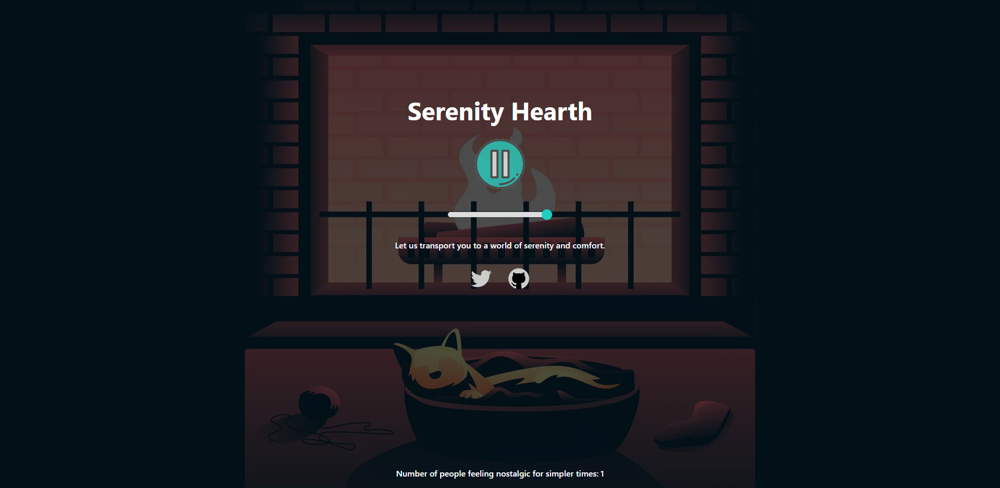

# Serenity Hearth

## Full-stack single audio streaming website

#### [URL](https://serenity-hearth.vercel.app/)

A simple audio streaming website that allows you to stream an audio of a purring cat next to a crackling fireplace. You can also see the current amount of people streaming the audio in real time via websockets. Inspired by Rainymood.

There's a bug where the websocket connection is lost after a phone has been idle for a while which I don't know how to fix.



### Technologies and libraries used:

Next.js, Typescript, TailwindCSS, Express.js, Socket io

## How to install

Download and install Node and NPM from https://nodejs.org/en/download.

Once downloaded, run thes commands in the terminal:

Follow the instruction in `.env.example` to set environment variables in each of the folders.

```ts
$ git clone https://github.com/mrperrytpx/garbgarb
```

First terminal

```ts
$ cd nextjs-client
$ npm install
```

Second terminal

```ts
$ cd socket-server
$ npm install
```

###### nextjs-client

`npm run dev` to run it in dev mode.
`npm run build` to make a production build, run the production build with `npm run start`.

###### socket-server

`npm run dev` to run the server with the nodemon package.

## Introspection

#### `Why did you build this project?`

I built this project to play around with websockets and to see how the connection between a socket on the client and the server works.

#### `What did you learn?`

I learned that handling reconnections for websockets is harder than originally imagined. I learned how to stream chunks of data from a Node Express server to the client, even though I don't use it in the final version.
